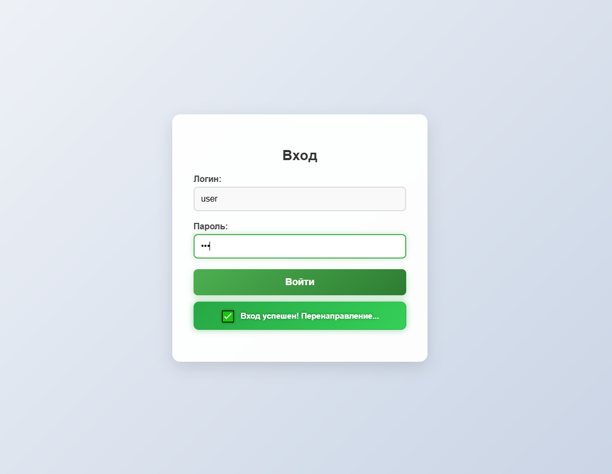
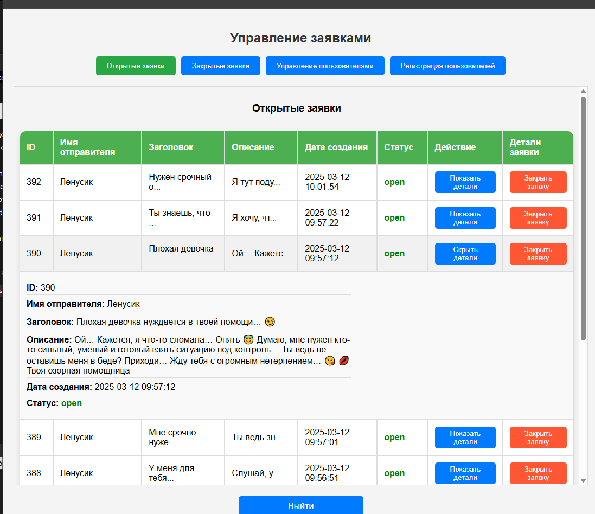
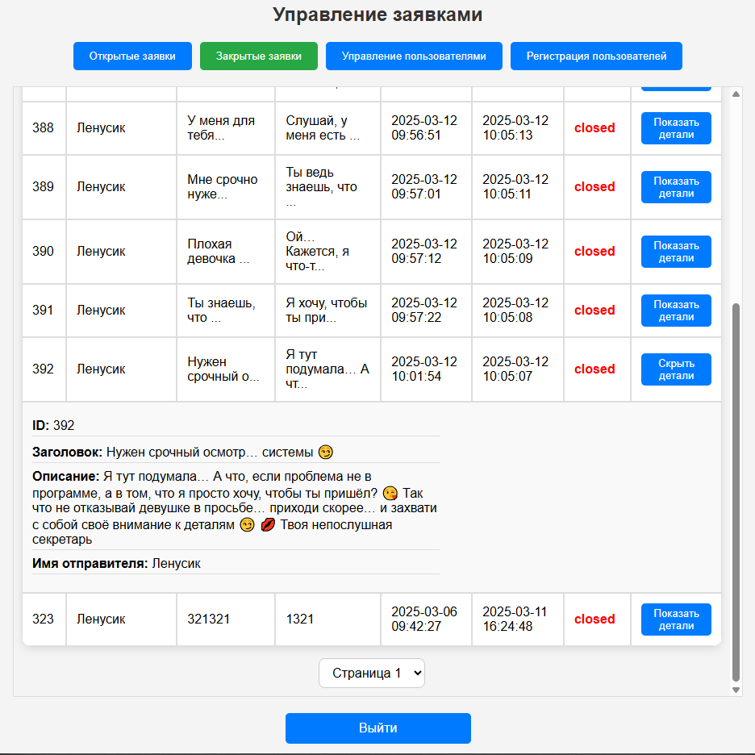
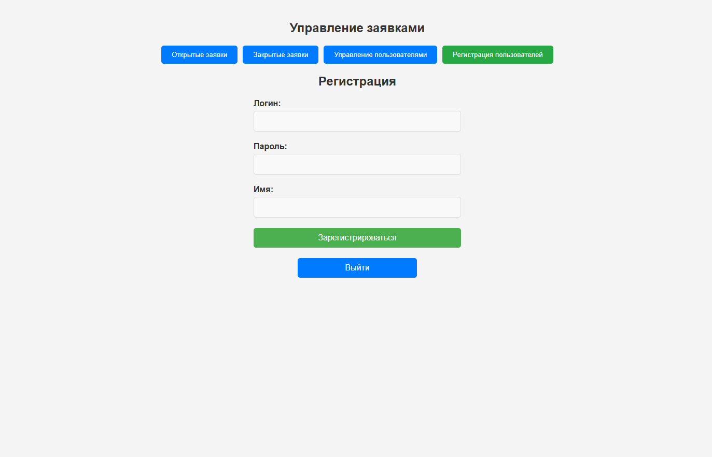
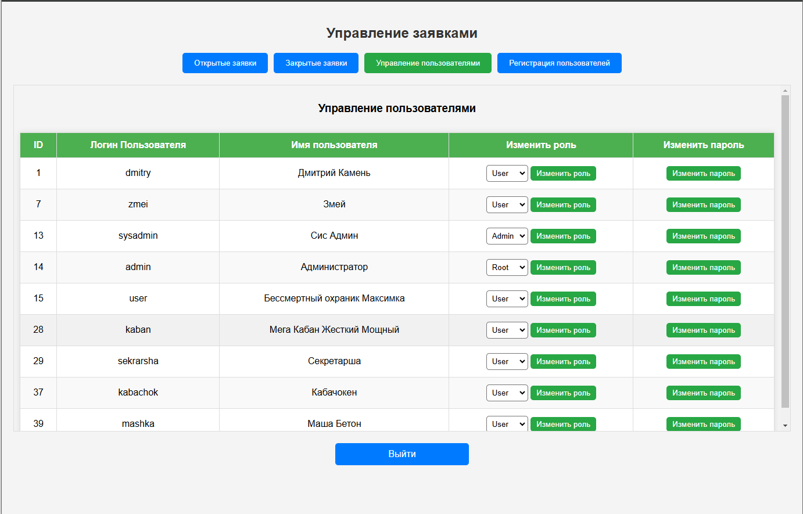
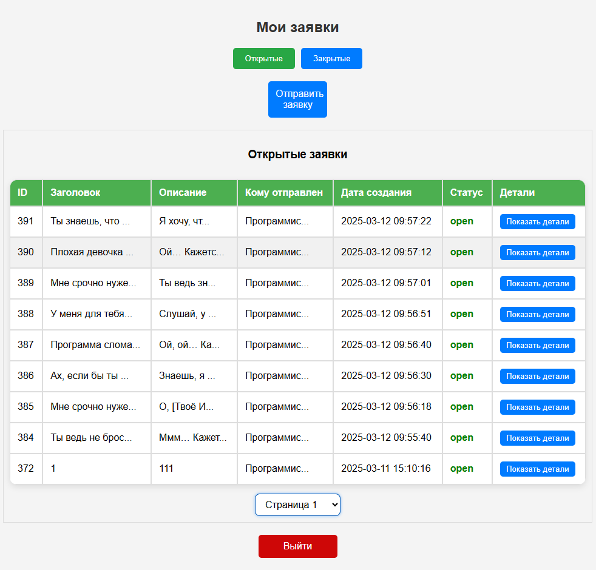
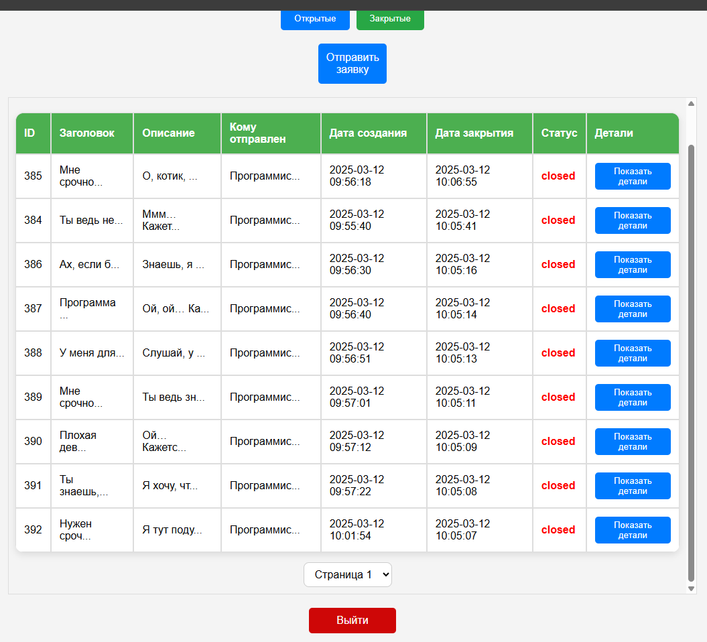
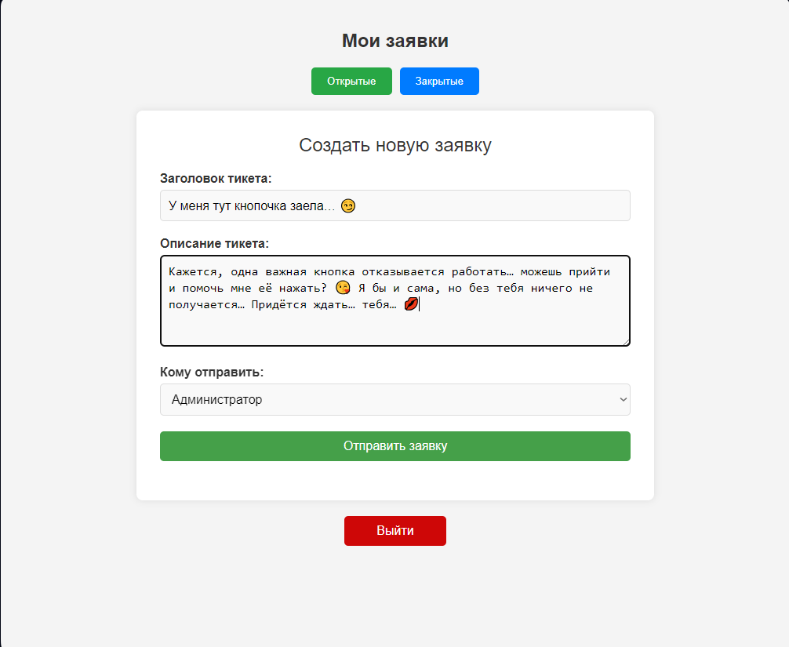

# Ticketing_System_WEB
Клиент-серверное приложение для управления заявками с использованием PHP, jQuery и AJAX.

🚀 Функциональность
🔹 Роли пользователей

Отправители – создают и отправляют заявки.
Администраторы – обрабатывают заявки и управляют пользователями.
🔹 Основные функции

Авторизация и регистрация пользователей.
Создание, просмотр и управление заявками.
Разграничение прав доступа.
Управление пользователями (для админов).
📌 Технологии
Backend: PHP (без фреймворков)
Frontend: HTML, CSS, jQuery
AJAX: динамическая загрузка данных без перезагрузки страниц
База данных: MySQL
🔧 Установка
1️⃣ Настроить сервер
Требуется Apache + MySQL (XAMPP, OpenServer или аналогичный стек).

2️⃣ Импортировать базу данных
Файл: ticket_system.sql

3️⃣ Настроить подключение к БД
Файл: db.php

php
Копировать
Редактировать
define('DB_HOST', 'localhost');
define('DB_NAME', 'ticket_system');
define('DB_USER', 'root');
define('DB_PASS', '');
4️⃣ Запустить сервер
Запусти Apache и MySQL, затем открой index.php в браузере.

 <h2>🖥️ Превью</h2> 
 
 <b>

 <h2>🖥️ Авторизация</h2> 
 
 <b>

  

 <h2>🖥️ Админ панель</h2> 
 
 <b>
🔹 Открытые заявки:

  

🔹 Закрытые заявки:

  

🔹 Регистрация пользователей:

  

🔹 Управление пользователями:

  

 <h2>🖥️ Панель пользователя</h2> 
 
 <b>
🔹 Открытые заявки:

  

🔹 Закрытые заявки:

  

🔹Отправка заявки:

  
